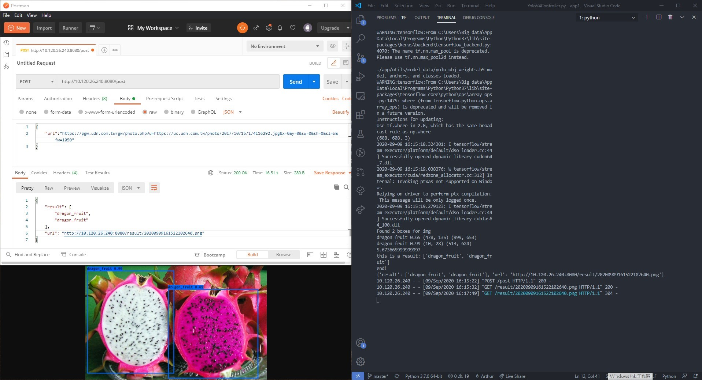

# framework structure
## It's based on a LITE MVC structure

+---app
|   |   __init__.py
|   |   
|   +---Controller
|   |       YoloV4Controller.py
|   |       
|   +---Service
|   |       YoloV4Service.py
|   |       
|   +---static
|   |   +---get_img
|   |   |       get_img.jpg
|   |   |       get_img1.jpg
|   |   |       
|   |   \---result_img
|   \---utils
|       |   test.py
|       |   
|       +---font
|       |       FiraMono-Medium.otf
|       |       SIL Open Font License.txt
|       |       
|       +---model_data
|       |       coco_classes.txt
|       |       obj_classes.txt
|       |       tiny_yolo_anchors.txt
|       |       voc_classes.txt
|       |       yolo-obj_last.weights
|       |       yolo4_anchors.txt
|       |       yolo_anchors.txt
|       |       yolo_obj_weights.h5
|       |       
|       \---yolo4
|               model.py
|               utils.py
|               __init__.py
|               
\---git_img
        result.jpg
        structure.jpg
        


# Prepartion
## Download weight
[Yolo_obj_weights.h5](https://drive.google.com/file/d/1NqbM5jsrSCPd25o2YSzQ0n4hv_QGKuXb/view?usp=sharing)

## put it in the following path

```cmd
./app/utils/model_data/
```
## change the hostname in runserver.py

# Run Server
```cmd
python runserver.py
```

# requests.post
requests.post with json (your image url)
(return json(result text, and result image url))
```cmd
http://<your host>:8080/post
```
# result (by POST MAN)


